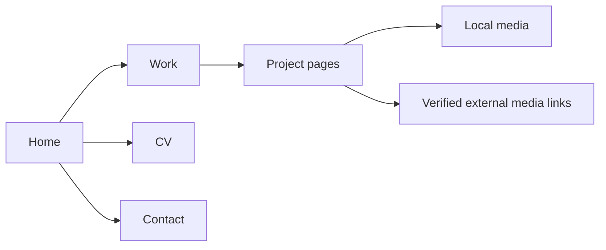

# Jlicerio Portfolio Design

## Goal

Create a separate personal portfolio site for Juan Licerio. Publish it on GitHub Pages at `https://jlicerio.github.io/portfolio/`. Keep it distinct from Hypergraphia Studio.

## Source of truth

Use the archive at `/Users/selfsim/Desktop/Projects/portfolio details/site/` as the content source. Do not modify the archive. Reuse its local images, project descriptions, CV focus, navigation labels, and verified media URLs.

## Information architecture

Pages:

- `index.html`: personal hero, biography, and selected work list.
- `work.html`: complete project index.
- `projects/*.html`: Motion, Forget Me Not, 9ine5ive6eis, Triqueta, Tigers Blood, Archived Works, and River Pierce.
- `cv.html`: focus areas and selected work.
- `contact.html`: contact route and available contact links.

## Visual direction

Use the Hypergraphia visual language without using the Hypergraphia name.

- Dark mode default: `#07080a` background and `#f2f0ec` text.
- Light mode: `#f2f0ec` background and `#07080a` text.
- Borders use the matching low-opacity text color.
- Headings use Space Grotesk.
- Utility text uses DM Mono.
- Use open editorial sections, thin rules, large type, and restrained motion.
- Avoid blank cards, placeholder media, gradient decoration, and invented project details.

## Content and media rules

- Use archive cover images for project rows and project heroes.
- Render each non-empty archive gallery with real local files.
- Render each non-empty video list with its real Adobe or Instagram URL.
- Provide a direct external link when an embed fails or is unavailable.
- Hide empty gallery, video, and link sections.
- Add useful alt text for every local image.
- Preserve the archive's project descriptions and tools unless a broken or misleading statement requires correction.

## Interaction and responsive behavior

- Use one shared header with Work, CV, and Contact links.
- Use a theme toggle with `localStorage` persistence.
- Use semantic headings, links, figures, and lists.
- Keep project pages readable on narrow screens.
- Use relative URLs so the site works under the GitHub Pages project path.

## Deployment

- Create public repository `jlicerio/portfolio`.
- Use GitHub Actions Pages deployment from `main`.
- Include `.nojekyll`.
- Verify the homepage, every project page, every local image, and every local script after deployment.

## Acceptance criteria

- The archive remains unchanged.
- The new site has no broken local asset requests.
- The site has no visible blank media placeholders.
- All navigation links resolve.
- The theme toggle works in both modes.
- The live Pages URL returns HTTP 200.
- The browser shows the new site with no console errors.
